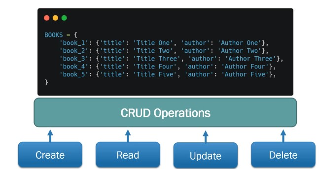
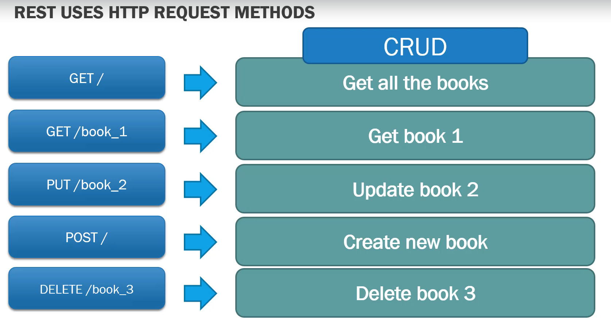
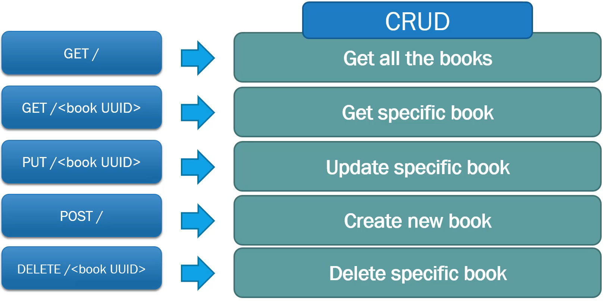
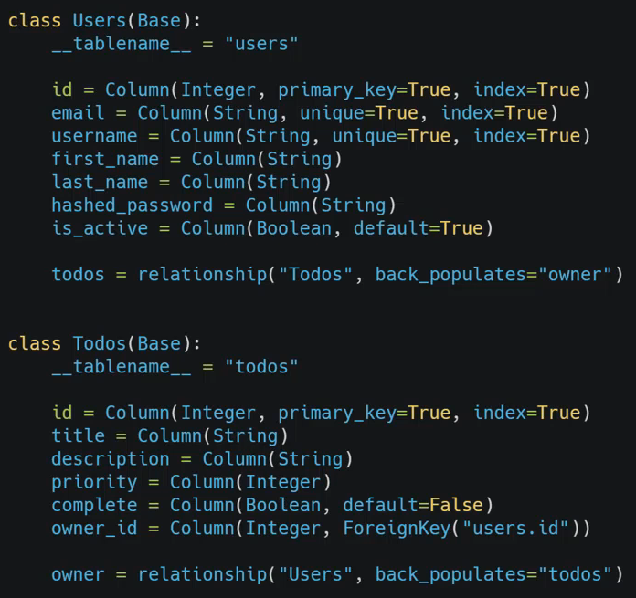
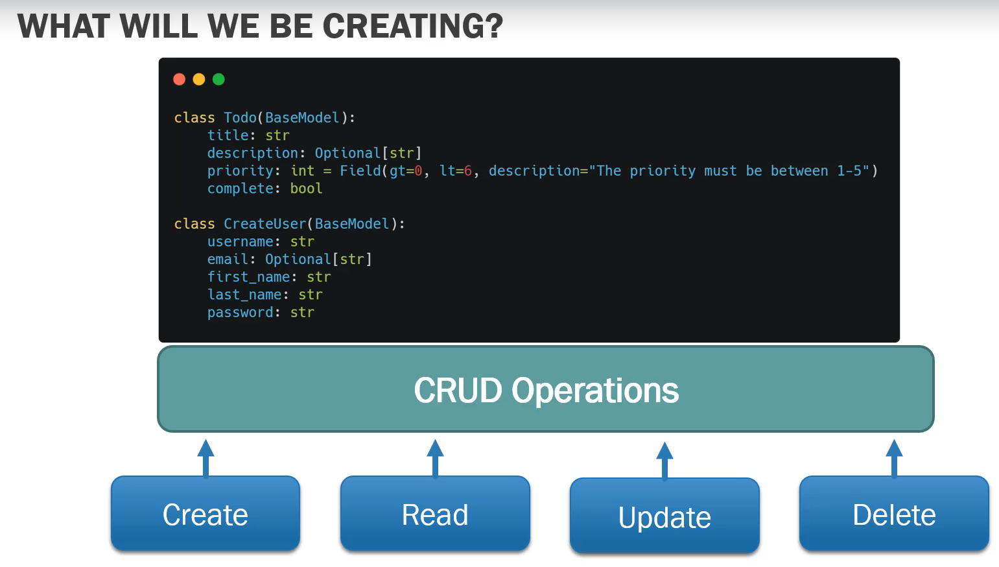
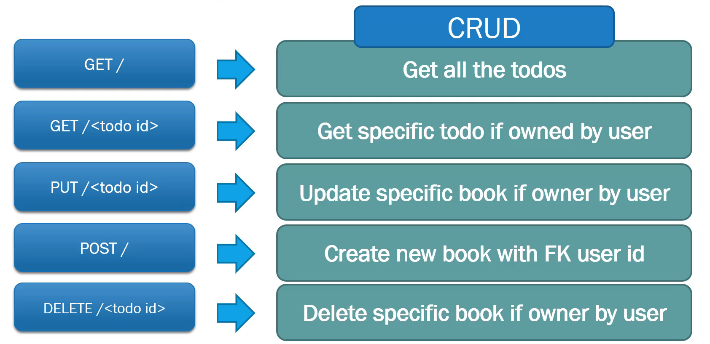

# FastAPI
FastAPI is a modern, fast (high-performance), web framework for building APIs with Python 3.7+ based on standard Python type hints.
# Projects

## Project - 1 : Book 1
In this project we will create a simple web framework to perform the crud operations.
#### We will be doing 

#### The Crud Operations

## Project - 2 : Book 2

In this we will follow the class objects to create book with several attributes. We will use pydantic to do data validation coming from client.
#### The Crud Operations

## Project - 3 : To-Do

In this we will create a todo app with database.

There will be two tables one for user and other for to-do.

#### The table structure

### The Flow
* API using Request methods
* Used SQL database to save todos
* Authentication (telling the system who you are by providing username and password) using Bcrypt hashed password
* Authorization (things you can do according to who you are) using JSON web tokens(JWT)

APIs for various CRUD operations

* User needs to login
* Once our algorithm verifies the user we send JWT
* We embed it with our application
* The client will then have attach this JWT to Each request, or they will be denied and sent a 401.

#### The Crud Operations
